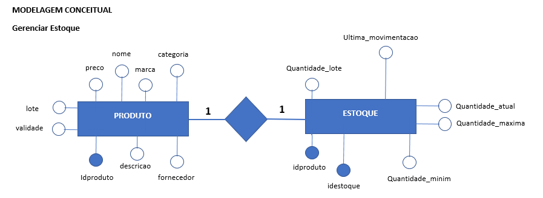
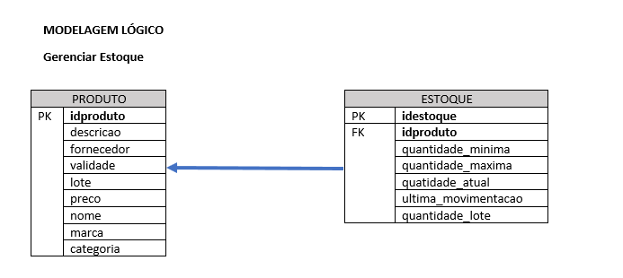

# ESTUDO DE CASO
## CASA OLIVEIRA

Roberto é dono de um mercado no bairro de Vargem Grande, na cidade de Tupã. Ele herdou o negócio de seu pai, Gumercindo Oliveira, ela foi aberta em 1978 na garagem da casa da família, era uma pequena quitanda. Com o passar dos anos o negócio cresceu e Gumercindo foi obrigado a ir para outro ponto maior e ali permaneceu até os dias atuais.

Roberto, que agora é o novo dono do mercado continuou o negócio seguindo da mesma forma que o pai. Ele comprava diretamente com os fornecedores grandes volumes de produtos e armazenava em seu estoque. As vezes ele comprava muitos produtos que ainda havia em estoque causando uma sobrecarga de produtos, ele também tinha muitos produtos estragados, tais como: frutas, legumes, iogurtes, leites, frango, etc. Também havia muitos produtos com o prazo de validade vencido.

Os funcionários eram poucos e faziam muitas coisas ao mesmo tempo. O açougueiro também ajudava no estoque, a moça da limpeza ajudava na organização dos produtos das prateleira, além de ajudar na padaria, quanto o caixa estava vazio o operador ajudava a repor os laticínios e a limpar a loja. O repositor também fazia operação no caixa.

Ao realizar a venda o Roberto, que sabia o nome de quase todos os clientes, anotava em um caderno todos os produtos que vendia e que havia em estoque. Ao fim do dia , Roberto pegava o caderno de fazia os cálculos de o quanto havia vendido, somando o faturamento e realizando a atualização do estoque. Isso é feito todos os dias e tomava um tempo considerável para que tudo tenha sido feito.

Roberto fechava a loja as 18h, mas só ia para casa as 22h, após fazer todas as operações necessárias. Mesmo assim o negócio vai bem e Roberto pretende ir para outro ponto e aumentar o volume de negócios e contratar novos funcionários.

Marica, esposa de Roberto, vem conversando com ele há muito tempo para que ele contrate uma empresa para construir um sistema de informática para gerenciar o negócio e reduzir o tempo que ele passa trabalhando e tenha maior organização dos produtos, maior lucratividade e melhorar a gestão.

Com a intenção de aumentar o negócio, Roberto está disposto a informatizar sua empresa. Vamos ajudá-lo. Iremos começar construindo o banco de dados.


### PROBLEMAS A SOLUCIONAR

#
•	GERENCIAMENTO DE ESTOQUE
- Informações sobre os produtos (validade, valor, lote, nome, descrição, marca, IDproduto, categoria, fornecedor).
- Volume de produtos em estoque (quantidade_atual, quantidade_lote, ultima_movimentacao, quantidade_maxima, quantidade_minima, idproduto)
#

•	FUNCIONÁRIOS
- Informações (nome, função, salário, matrícula, CPF, RG, telefone, email, estado civil, admissão, data_nascimento, endereço, usuário, senha, IDfuncionario)
#

•	FLUXO DE CAIXA: (ENTRADA E SAÍDA DE VALORES)
- Fluxo (forma_pagamento, limite_sangria, valor, entrada e saída, regitro_venda)
•	GESTÃO DO PATRIMÔNIO: COMPUTADORES, PRATELEIRAS, MESAS, CADEIRAS, CAIXAS, BALCÕES, PADARIA, BALANÇAS ETC.
- Informações (IDPatrimonio, código_patrimonio, descrição, valor, setor_pertencente, data_aquisicao, setor_responsavel, data_baixa)
#
•	SETOR COMPRAS
- Informações (IDCompra, funcionário, valor_pag_produto, fornecedor, data_compra, numero_nota_fiscal, nome_produto, descrição, consumível, quantidade, setor_destino
#
•	SETOR FINANCEIRO
- Informações (IDFinanceiro, despesas, lucro, disponibilidade_cofre, valor, tipo_valor, descrição, data_operacao, identificação_responsavel)
#
### MODELO CONCEITUAL




#

### MODELO LÓGICO




---
### MODELO FÍSICO

Código e docmentação do modelo físico

/* Para o projeto de banco de dados da casa Oliveira será criado 
uma estrutura física com os comandos SQL (Structure Query Language).
Iremos começar com o comando de criação de banco de dados. 
Este comando pertence a categoria de comandos DDL (Data Definition Language)
Comando:
	CREATE DATABASE nome_do_banco -> CREATE DATABASE casaoliveira */

CREATE DATABASE casaoliveira;
/* Após a criação do bando de dados é necessário selecioná-lo. 
Para isso iremos usar o comando USE nome_do_bancodedados*/

USE casaoliveira;
/*Criação das entidades em modo físico usando os comandos SQL.
Para criar uma tabela (entidade) usaremos o comando
CREATE TABE nome_da_tabela seguido por parenteses e os
atributos (campos) da tabela tem como a sua tipificação, ou seja,
devemos dizer qual o tipo de dados que cada campo (atributo) da 
tabela deve receber. Ex.: o campo idade deve receber valores 
numéricos e, portanto será definido como int(inteiro).

Vamos criar a tabela de produtos. Esta tabela possui os seguintes campos:
- idproduto, descricao, fornecedor, validade, lote, preco, nome, marca e categoria.
```
Para cada produto será definido um tipo de dado.

Para o idproduto, iremos definir como:
	- Chave-Primária (Primary Key) é nosso campo indexador, por ele será 
    realizado o relacionamento com outras tabelas;
    - Vamos definir este campo como auto_incremente, o que permite gerar
    os ids de forma automática. Esse passo é importante, pois elimina alguns problemas, 
    tais como: concorrência, geração incrementada de valores e exclusividade de valores;
    - Vamos definir o campo o tipo de dado numérico INT (inteiro).
    

```
```
Para o campo descricao, usaremos o tipo de dado TEXT. Com este tipo podemos inserir até
64 mil caracteres. Como neste campo pode haver a possibilidade de uma descrição
longa do produto, se faz necessário um tamanho maior.
```
```
Para o campo fornecedor iremos usar o tipo de dado VARCHAR. Este tipo de dado nos
permite inserir textos, mas com um limite que pode ser pré definido pelo usuário ou
podemos utilizar o limite total de 255 caracteres. Para o fornecedor, usaremos 50 caracteres.
```
```
Para o campo validade iremos usar o tipo de dado DATE. 

Para o campo lote será definido o tipo de dado VARCHAR, pois há a possibilidade de um valor
conter caracteres alfadecimais. Sendo assim, o VARCHAR é uma ótima oão por aceitar valores diversos.

Para o campo preco será definido como DECIMAL. Com esse tpo é possível inserir valores numéricos
com a aplicação de casas decimais. Você define o comprimento e deste tamanho é configurado as
casas decimais. Ex.: DECIMAL(10,2) -> COMPRIMENTO DE 10 DIGITOS E DESTES TEMOS 2 CASAS DECIMAIS.
VEJA: 1111111111,11 -> R$ 11.111.111,11
```
```
Para os campos nome, marca e categoria será definido o tipo de dado VARCHAR, pois este tipo
é capaz de receber caracteres de texto. Precisaremos, apenas definir o tamanho de cada campo.
Ex.: nome pode ficar com o tamanho 50, marca pode ficar com 30 e categoria 20.*/
```
```
CREATE TABLE produto(
idproduto int auto_increment primary key,
descricao text,
forncedor varchar(50),
validade date,
lote varchar(20),
preco decimal(8,2),
nome varchar(50),
marca varchar(30),
categoria varchar(20)
); 
``` 
```
CREATE TABLE estoque(
idestoque int auto_increment primary key,
idproduto int, 
quantidade_maxima int, 
quantidade_minina int,
quantidade_atual int,
ultima_movimentacao date,
quantidade_lote int
);

```

